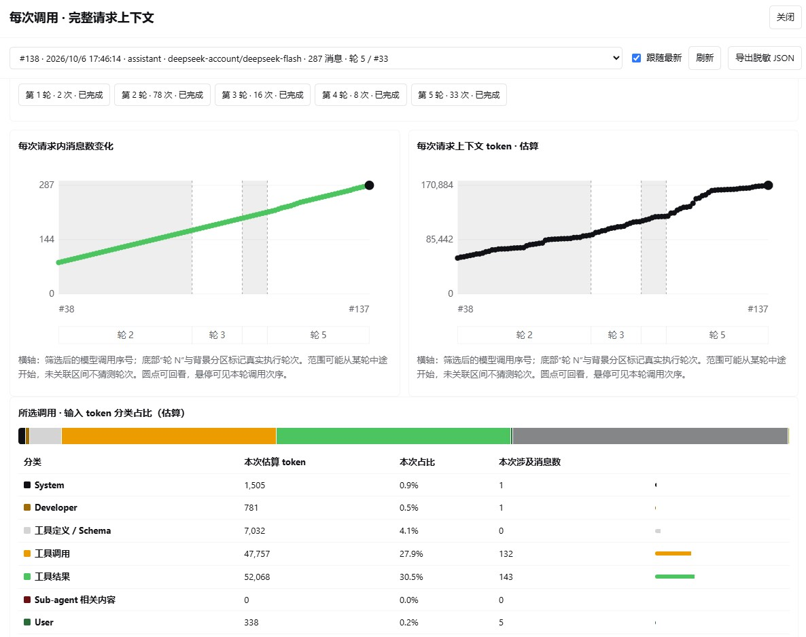

# 烧掉 1.4 亿 Token 之后，我才发现省钱的开关不在"少问几次"

两天时间，我在这台机器上用掉了 1.4 亿 Token。

看到这个数字的时候，我的第一反应很朴素：以后少问几次就好了。

后来我把 26 个会话的日志全部翻出来，逐次对了一遍，才发现这个直觉基本是错的。<span style="color:#0F4C81;font-weight:700">真正把钱吃掉的，跟我问了多少次关系不大。</span>

## 模型其实没有记忆

先说一个容易被忽略的前提：大模型 API 是无状态的，它不记得上一轮聊过什么。

你每问一次，客户端都要把这次对话之前的全部内容，重新发一遍。

也就是说，"这一问花了多少钱"，约等于"这一次重发的那一坨有多大"。我问一句"继续"，屏幕上只有两个字，可模型实际收到的是前面十几万字的历史。

比如我这两天里最长的一个会话，一共触发了 236 次模型调用，平均每次要重发 14 万 Token 的上下文，光这一个会话就重发了 3300 万 Token。

所以省钱的思路要么让"这一坨"变小，要么让它别按原价算。<span style="color:#0F4C81;font-weight:700">而后者才是关键。</span>

## 重复发送为什么还能便宜

如果每一次重发都按原价计费，我们每追问一句，都要替前面整段历史再付一次全价，服务端也得把同一段前缀从头再算一遍。缓存对双方都有好处，这也是命中价能便宜到五十分之一的原因。

机制其实不复杂：服务端会把请求的前缀缓存下来，下一次只要前缀一模一样，这部分就按命中价计费，大约只有未命中的五十分之一。

整个链条大致是这样：

```text
一次新请求
   ↓
前缀和上次一样吗
   ↓
一样：命中缓存，按便宜价结算
   ↓
不一样：从第一个不同的位置开始，后面全部按原价重算
```

这就是为什么我这 1.4 亿 Token 里，有 96.5% 只是"把同一段历史反复重发"，真正的价格大头并不在它身上。

那"前缀"到底指什么？

其实很简单：一次请求在模型眼里就是一串 Token，前缀就是从第 0 个 Token 开始、连续的那一段开头。缓存存下来的，就是"这段开头我上次已经算过"。

匹配条件很严格：<span style="color:#0F4C81;font-weight:700">必须从第一个 Token 起完全一致，差一点都不算</span>；一旦某个位置不一样，从那里往后全部作废，只有前面那一截还能复用。命中长度还会按固定单位取整，所以有时只多出一点点新内容，也得等下一轮才被缓存下来。

这也解释了为什么<span style="color:#0F4C81;font-weight:700">在末尾追加没事、在开头或中间改动很贵</span>。我们每问一轮，新增的消息和工具结果都挂在末尾，前面的 Token 一个没动，缓存几乎全中；但工具定义和系统提示排在消息列表前面，一改就断在很靠前的位置，后面的历史全部按原价重算。换模型更彻底，缓存按模型隔离，直接归零；压缩历史则断在被改写的地方。

所以<span style="color:#0F4C81;font-weight:700">别在会话中途改设置</span>，这不是经验之谈，而是前缀匹配规则的直接推论。

## 真正贵的是那 20 次

缓存很便宜，但它有个前提：前缀得一模一样。

只要请求的前缀被改写了，缓存立刻作废，从改动的位置开始，后面整段上下文都要按原价重新算一遍。我这两天里，这样的调用一共出现了 20 次。

20 次听起来不多，它只占全部调用的 1.7%。但它们吃掉了全部未命中 Token 的 50.3%，也就是说，我按原价付的钱，有一半花在这 20 次上。

原因也不神秘，就是四类：

| 成因 | 次数 | 按原价重算的 Token |
| --- | --- | --- |
| 压缩历史之后的连锁重算 | 11 | 106 万 |
| 长时间空闲后恢复会话 | 5 | 83 万 |
| 会话中途切换模型 | 3 | 48 万 |
| 会话中途增加工具 | 1 | 16 万 |

最贵的一笔，是我在一个 19.8 万 Token 的长会话里换了模型。换模型意味着请求头、参数都变了，于是整段历史按原价重发了一次。就那一下，比我前面几十次正常对话加起来都贵。

这里我得承认一件事。我一边在算"怎么省 Token"，一边在会话中途换模型、中途启用插件、让一个会话空转两个半小时再回来继续。写这篇复盘的时候我才反应过来，最贵的那几笔，都是我自己按下去的。

## 钱到底花在哪

如果把 DeepSeek 计费的会话单独拎出来看，钱主要花在三个地方。

| 花钱的地方 | 占比 |
| --- | --- |
| 模型写出来的内容（回答加工具参数） | 46% |
| 重复发送的历史（缓存命中价） | 29% |
| 按原价重发的部分 | 25% |

这里有个很反直觉的反差：占输入量 96.5% 的缓存内容，只花了 29% 的钱；而只占 3.5% 的未命中内容，花了 25%。

所以<span style="color:#0F4C81;font-weight:700">"省 Token"和"省钱"是两本账</span>，混在一起算就会得出错误的结论。

关心窗口和响应速度，就该去压上下文的规模；<span style="color:#0F4C81;font-weight:700">关心钱，就该先保住缓存前缀，其次才是压规模</span>。两者交汇的地方，恰恰是那 20 次整段重算，因为账单等于"上下文规模乘以未命中单价"。

## 为了看见这件事，我写了个插件

上面这些数字，靠猜是猜不出来的。Harness 的用量面板只给总数，不会告诉你系统提示、工具定义、历史消息、工具结果各占多少，也看不出某一轮对话实际发生了几次调用。

所以我写了个本地插件：在 Harness 把请求组装好、交给供应商适配器之前，用一个同步钩子把那次调用的完整参数截一张快照，再在会话标题旁边开一个面板把它画出来。

快照按内容寻址去重，同样的消息只存一份，所以能看到每次完整展开而磁盘不会爆；插件不碰凭据、不做 HTTP 抓包、不加裸路由，只读已经组装好的参数。

装上之后大概长这样：



左边是每次请求的消息数变化，右边是上下文 Token 的估算曲线，下面是这次调用的分类占比。截图里这一次调用，工具结果和工具调用两项就占了将近六成，而系统提示加工具定义不到 5%。

顺带还看见一件事：内容量高度集中在少数几个长会话里。最重的 5 个会话，占了全部输入 Token 的约四分之三。

## 有的读者可能会问

既然是"少问几次没用"，那是不是该少读点文件、少用点工具？

我一开始也这么想，但数据不支持。真正算得上冗余的调用（整步只是在重读已经读过的文件，或者完全重复同一次调用）只占 6.1%，折成钱是零头。<span style="color:#0F4C81;font-weight:700">省调用次数不是主要矛盾。</span>

那是不是只要保证缓存命中，就等于白嫖？

也不是。缓存命中的单价虽然只有未命中的五十分之一，但它乘以的次数很多；而且窗口压力只由上下文规模决定，跟缓存价格没关系。<span style="color:#0F4C81;font-weight:700">长会话该收尾还是得收尾。</span>

还有个边界要交代：这个样本只有两天、一台机器、26 个会话，其中一部分走的是另一套价目的模型。它说明的是这台机器上的实测，不是普适规律。不过"缓存前缀失效要付整段钱"这个机制，跟具体哪家供应商无关。

## 回到现实，六条能落地的做法

机制讲完了，剩下的是执行。按划算程度排：

第一，<span style="color:#0F4C81;font-weight:700">一个会话里中途不要换模型、不要增删工具</span>。这一条不收钱、立刻见效，直接消掉上面最贵的那几次重发。真要换，新开一个会话。

第二，<span style="color:#0F4C81;font-weight:700">长时间没动过的会话，直接新开，别恢复</span>。缓存多半已经过期，恢复等于整段重发。

第三，<span style="color:#0F4C81;font-weight:700">长对话及时收尾，资料尽量一次读完</span>。这是唯一能真正缓解窗口被塞满的办法，也顺手压低了每次重发的规模。

第四，<span style="color:#0F4C81;font-weight:700">压缩要少而准</span>。频繁地小步压缩会反复改写前缀，触发后面几轮的连锁重算，看起来省了空间，实际花了钱。

第五，<span style="color:#0F4C81;font-weight:700">回复和工具参数不要写太长</span>。输出走全价、不吃缓存，是计费里最大的那一项。

第六，顺手清理两件小事：把从来没用过的工具关掉（我这里有 31 个工具，7 个一次都没调用过），<span style="color:#0F4C81;font-weight:700">派子代理只派重活</span>，因为短任务里它的固定开销能占到三成。

## 写在最后

回头看，这件事真正的转折点不是"我学会了省 Token 的技巧"，而是我终于能看见自己是怎么花钱的了。

三个我现在会记住的判断：

一是，无状态接口的成本，本质上是"<span style="color:#0F4C81;font-weight:700">上下文规模乘以调用次数</span>"，这是滚雪球的账，不是线性账。

二是，缓存价差让"省 Token"和"省钱"分成了<span style="color:#0F4C81;font-weight:700">两本账</span>，先想清楚自己要省哪一本，再去动手。

三是，最贵的浪费往往不是模型干的，而是使用者在会话中途做的那些"<span style="color:#0F4C81;font-weight:700">顺手的小改动</span>"。

最后说一句实话：上面六条里，第一条和第二条最难做到，因为它们要求你在想换模型的那一瞬间忍住，而这恰恰是人最容易放弃判断、交给工具去处理的时刻。

插件已经开源在 GitHub（`classicer/dsh-request-context`，MIT）。它会告诉你钱花在哪，但忍住不换模型这件事，还得自己来。

## 关于这些数字

金额是按 DeepSeek 官方 2026-10-06 的价目估算的（每百万 Token：缓存命中 0.02 元、未命中 1 元、输出 4 元，低谷价），两天大约 11 元。另有一部分会话走的是另一套价目的模型，只统计 Token，不计金额。

统计时剔除了 fork 出来的子代理会话所复制的父会话历史，不剔除的话，调用数会虚高约三成、输入 Token 会虚高约三成六。

想算自己的账，可以用同一套脚本：`docs/audit/token-audit.mjs`，零依赖，只读你本机的会话日志，跑出来的是你自己的数字。
